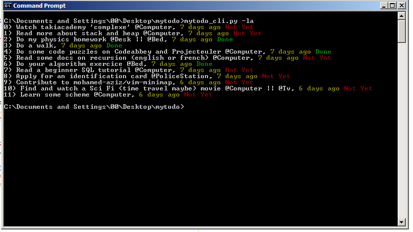
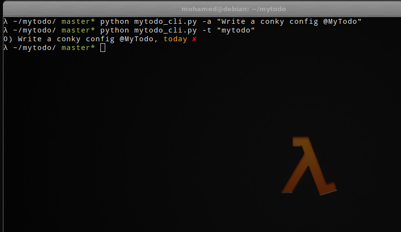

# Mytodo

Mytodo is a free/libre (as in speech) todolist manager it protects totally the privacy of the user because the user himself will setup and hack this script for his own sake, basically this project focuses more on the user freedom rather than the quality of the software which comes in a second place.

This project mainly contains two parts the server part which is a really simple RESTful API that you can setup on any old machine or even a raspberry pi and a client software.

For the client part we have already :

  - A console based client.
  - A really simple GUI tool.

##Screeshots

Under Debian GNU/Linux :


Under Windows XP :




Search by tag



A very simple conky example:

 

## Setting Up:

This project is written in python (version 2) so you need to have it installed if you are running a GNU/Linux distribution like Debian or whatever I suppose that you have it installed.

You could get mytodo using pip :
    # pip install mytodo

Now you can edit you will setup a file called mytodoconfig.json in your home directory which contains the following

```
{
    "username" : "mohamed",
    "password" : "root",
    "host"     : "http://localhost:5000/"
}
```

NOTE : We do not support user creation for now do it manully for now or use mohamed:root.

You also need to edit the database path in the server config under mytodo/mytodoweb/config.py .

You should now start the server using mytodo_server.

So the basic mytodo_cli usage is :

to add a task:

	mytodo_cli -a "Do my math homework"

to list all (Completed and uncompleted tasks):

	mytodo_cli -la 

to list only uncompleted tasks:

	mytodo_cli -l

to mark a task as done :

	mytodo_cli -d number

to mark a task as undone:

	mytodo_cli -ud number

to delete a task :

	mytodo_cli -r number

to specify user other user and password:

	mytodo_cli -u username -p password

to search by tag:
    
    mytodo_cli -t "Mytodo"

------------------

For the GUI you just call it using:

	mytodo_gui

the usage is simple I think you know your way out...

Happy hacking !

------------------

## TODO or brainstorming:
  X Write a web application.
  - Write an android application (using kivy maybe I started discovering it)
  - Improve the GUI
  - Add the ability to record sounds and videos
  - The ability to draw using the mouse or the touchpad

(These ideas are worthless if they are not implemented)

## Contributing to the project:

If you really like mytodo and want to contribute you can work with the code
or write docs or wiki, contact me at  medazizknani[at]gmail.com

Or you can even help with spreading mytodo on the World Wide Web.


[](https://bitdeli.com/free "Bitdeli Badge")

