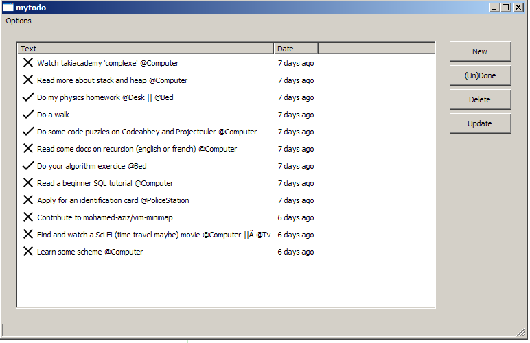
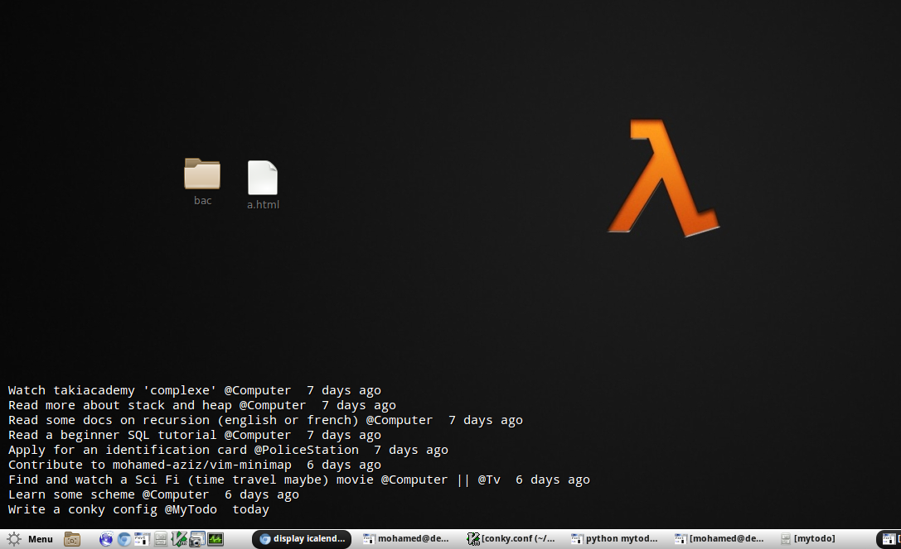

# Mytodo

#### Warning : this software is still in development don't use in production.

Mytodo is a free/libre (as in speech) todolist manager it protects totally the privacy of the user because the user himself will setup and hack this script for his own sake, basically this project focuses more on the user freedom rather than the quality of the software which comes in a second place.

This project mainly contains two parts the server part which is a really simple python code you can setup on any old machine or even a raspberry pi and a client software.

For the client part have already :

  - A console based client.
  - A really simple GUI tool.

##Screeshots

Under Debian GNU/Linux :

Under Windows XP :

Search by tag

A very simple conky example:

 

## Setting Up:

This project is written in python (version 2) so you need to have it installed if you are running a GNU/Linux distribution like Debian or whatever I suppose that you have it installed.

It also depends on WXpython and Sqlite3.
If you are using a GNU/Linux distribution you can get it:
for example on Debian :

	sudo  apt-get install python-wxgtkx.y sqlite3
colorama is optional (if you want some colors in your console and that works under windows too you shall install it) no more escape codes.

You can Install it using pip

	sudo pip install colorama

You can clone the repository using

	git clone https://github.com/mohamed-aziz/mytodo.git

Or you can download the zip.

Now after the dependencies are satisfied and you have your mytodo It's time to set it up.

I suggest that you add mytodo directory to your path so if you are using bash as your default shell it would be:

	echo "export PATH=$PATH:/home/username/mytodo/" >> ~/.bashrc

And then restart your terminal or just type in:

	source ~/.bashrc

Now you can edit you userconfig.json which contains the username and the password by default it's mohamed:root, if you want to change
that add a row in the database alternatively I will make a python script for doing the job for you.
Then you have to start the server so you should do :

	mytodo_server.py

and if you want to run it in background just do:

	mytodo_server.py &

now just start the client that you prefer I guess that you like the Command line version more because you are a nerd like me.

So the basic mytodo_cli.py usage is :

to add a task:

	mytodo_cli.py -a "Do my math homework"

to list all (Completed and uncompleted tasks):

	mytodo_cli.py -la 

to list only uncompleted tasks:

	mytodo_cli.py -l

to mark a task as done (the number is from the output of -la):

	mytodo_cli.py -d number

to mark a task as undone (the number is from the output of -la):

	mytodo_cli.py -ud number

to delete a task (the number is from the output of -la):

	mytodo_cli.py -r number

to specify user other user and password:

	mytodo_cli.py -u username -p password

------------------

For the GUI you just call it using:

	mytodo_gui.py

the usage is simple I think you know your way out...

Happy hacking !

------------------

## TODO or brainstorming:
  - Write a web application.
  - Write an android application (using kivy maybe I started discovering it)
  - Improve the networking code
  - Improve the GUI
  - Add the ability to record sounds and videos
  - The ability to draw using the mouse or the touchpad

(These ideas are worthless if they are not implemented)

